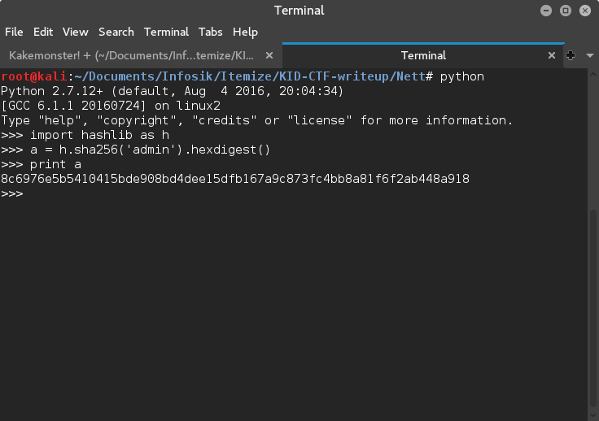
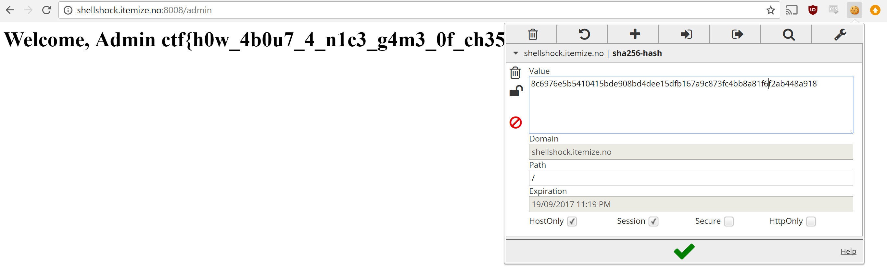

Oppgaven heter kakemoster, ofte i sammenheng med tilgangskontroll bruker man cookies.
Det er snakk om tilgang til et admin panel, og om man inspiserer småkakene på siden ser man at at man har en sha256-hash cookie.

Om du googler etter en reversert hash vil du finne ut at den du har fått er hashen til 'user'.

Mon tro hva som skjer om vi hasher 'admin' og limer inn det som verdi? Bruk gjerne en utvidelse ti chrome slik som EditThisCookie. Det gjør livet enklere.

Visst skal man se, istedenfor å få "Not logged in." får vi flagget!

Det gir oss følgende på http://shellshock.itemize.no:8008/admin

Som er en referanse til filmen WarGames. Kan anbefales!
